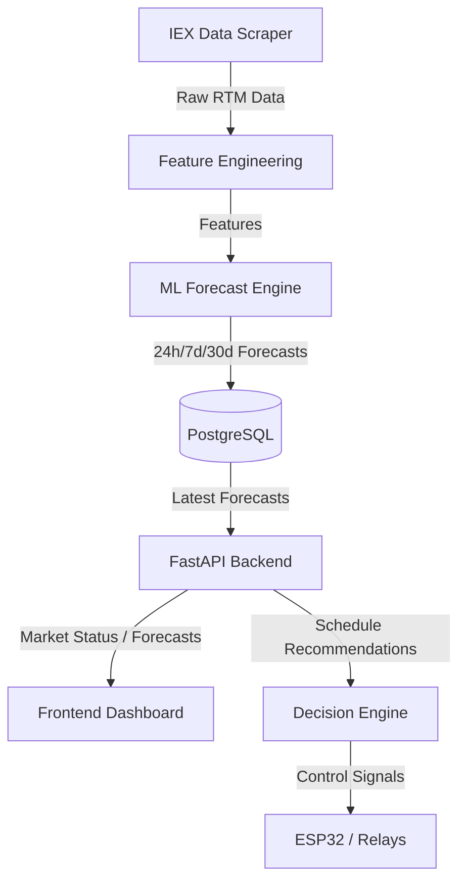

# Backend Handoff Document

This document outlines the architecture, data flow, database schemas, and decision logic of the AI-Powered Smart Energy Management System.

## 1. Architecture Diagram

## 2. Data & Forecast Flow

1. **Ingestion**: Raw IEX RTM files (CSV) are parsed by the `IEXParser`.
2. **Feature Engineering**: Features (lags, rolling averages, time properties) are constructed using the `RTMFeaturePipeline`.
3. **Forecast Generation**:
   - **24-Hour**: Generated via `RecursiveEnsembleForecaster` looping 96 times. Spike probabilities are added via XGBoost.
   - **7-Day & 30-Day**: Generated using Direct-Horizon models (LightGBM) functioning as anchor points, with linear interpolation to fill the 15-minute intervals.
4. **Persistence**: The `ForecastGenerationService` orchestrates writing to `forecast_runs` and `forecasts` tables via SQLAlchemy, and simultaneously archives to local CSV backups.

## 3. Database Schema (PostgreSQL)

- **`rtm_blocks`**: Stores actual, historical IEX data.
- **`forecast_runs`**: Identifies a generation event (Run ID, generated timestamp, model version, forecast type).
- **`forecasts`**: Stores individual 15-minute prediction blocks mapped to a specific `forecast_run_id`.
  - Columns: `forecast_timestamp`, `block_number`, `predicted_mcp`, `zone`, `confidence`, `spike_probability`, `lower_bound`, `upper_bound`.
- **`forecast_accuracy`**: Stores retrospective evaluation metrics (predicted vs. actual).

## 4. Decision Logic & Savings

The **Smart Load Decision Engine** dictates device operations based on the forecasted Zone and Spike Probabilities.

### Device Categories
- **Critical**: Must run 24/7 (e.g., life support, core servers).
- **Flexible**: Prefer to run, but can tolerate turning off during extreme peaks (e.g., HVAC).
- **Deferrable**: Can be paused easily during high prices (e.g., EV chargers, pumps).

### Zone Logic
- **GREEN Zone** (MCP < 3000): ALL Devices ON.
- **YELLOW Zone** (3000 ≤ MCP < 6000): Deferrable devices are turned OFF.
- **RED Zone** (MCP ≥ 6000): Flexible AND Deferrable devices are turned OFF.

### Spike Probability Interceptor
If `spike_probability` crosses a defined threshold (default > 0.5), the effective zone instantly upgrades to **RED**, regardless of the base predicted MCP. This creates a defensive posture against market volatility.

### Expected Savings Calculation
- **Baseline Cost**: The theoretical financial cost if all connected devices were left strictly ON across all forecast blocks.
- **Optimized Cost**: The cost incurred strictly adhering to the recommended OFF states.
- **Savings**: `Baseline - Optimized`.
